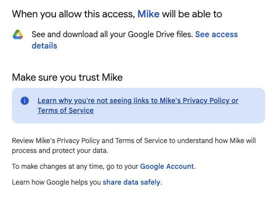
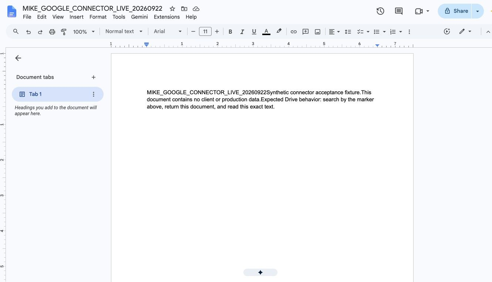
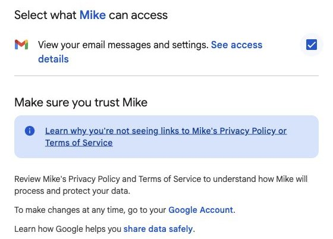
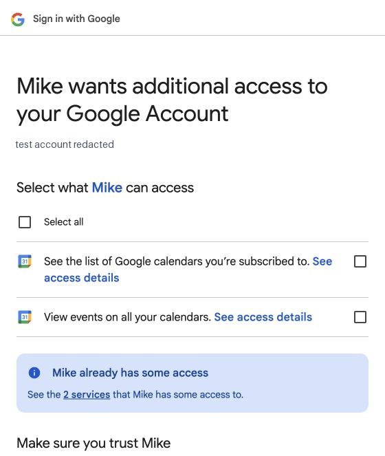
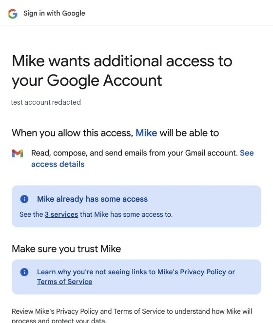
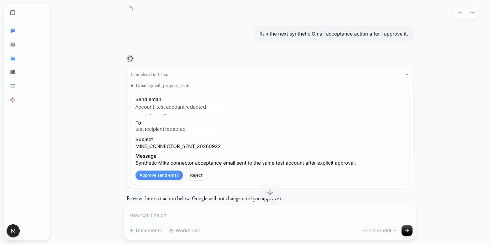
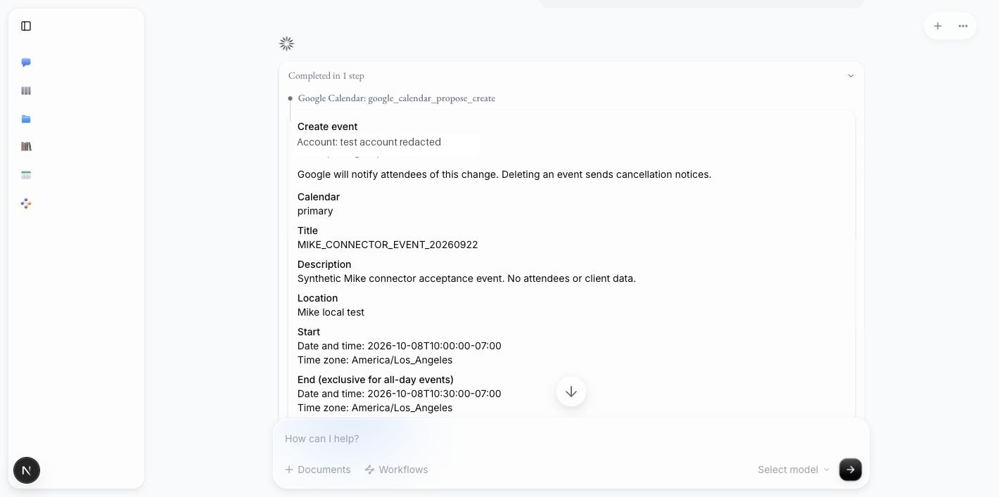
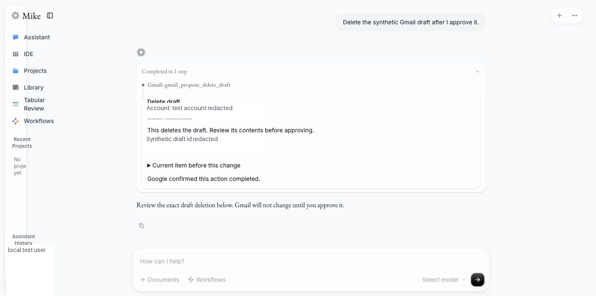

# Google Workspace connector live test report

Date: 2026-09-22

Pull request: [#522](https://github.com/open-legal-products/mike/pull/522)

Environment: local Mike web app at `http://localhost:3000`, local API at `http://localhost:3001`, local Supabase, Google OAuth project `mikeamal`
Google account: personal test account; address redacted from public evidence

## Result

Drive, Gmail, and Google Calendar passed live OAuth and provider API tests. Gmail and Calendar remain opt-in and independent of Mike sign-in. They connect read-only by default; write scopes require a separate Google consent flow. Every write was prepared as an immutable proposal and required an explicit user decision in the Assistant conversation before Mike called Google.

The approval experience was changed during this test. The initial implementation required users to leave Assistant and open Settings → Connectors. The final implementation renders the exact proposal inline in the conversation, keeps it expanded when assistant prose follows, and updates the same card with Google's result. Connectors retains recent action history only as a recovery surface.

## Google Cloud configuration tested

- OAuth audience: External, Testing.
- Test user: the account used for this report.
- Enabled APIs: Google Drive API, Gmail API, Google Calendar API.
- Local redirect URIs:
  - `http://localhost:3000/api/user/integrations/google-drive/oauth/callback`
  - `http://localhost:3000/api/user/integrations/gmail/oauth/callback`
  - `http://localhost:3000/api/user/integrations/google-calendar/oauth/callback`
- Read scopes:
  - Drive: `drive.readonly`
  - Gmail: `gmail.readonly`
  - Calendar: `calendar.calendarlist.readonly`, `calendar.events.readonly`
- Optional write scopes:
  - Gmail: `gmail.modify`
  - Calendar: `calendar.events`

No client secret, OAuth token, private mailbox content, or private calendar content is included in this report or committed to the repository.

## Live test matrix

| Area | Test | Result |
| --- | --- | --- |
| Account choice | Chose a Google account independently of the Mike login | Pass |
| Opt-in | Confirmed that visiting Mike after Google SSO does not connect Drive, Gmail, or Calendar | Pass |
| Drive consent | Granted only read/download access | Pass |
| Drive search | Searched for `MIKE_GOOGLE_CONNECTOR_LIVE_20260922` | Pass |
| Drive read | Exported and matched the exact synthetic Google Doc text | Pass |
| Gmail read consent | Granted `gmail.readonly` without write access | Pass |
| Gmail reads | Listed labels, confirmed `INBOX`, searched and read the synthetic message | Pass |
| Gmail write upgrade | Re-consented with `gmail.modify` | Pass |
| Gmail draft create | Proposal displayed exact account, recipient, subject, and body; no mutation before approval | Pass |
| Gmail draft update | Re-read the draft, displayed prior state, checked the current Gmail version, then updated after approval | Pass |
| Gmail draft delete | Deleted only after inline approval | Pass |
| Gmail send | Sent a synthetic message to the same test account only after inline approval | Pass |
| Gmail label edit | Added `STARRED` only after inline approval | Pass |
| Gmail cleanup | Moved the synthetic message to Trash only after inline approval | Pass |
| Calendar read consent | Granted calendar-list and event read scopes | Pass |
| Calendar reads | Listed five accessible calendars and searched a bounded date range | Pass |
| Calendar write upgrade | Re-consented with `calendar.events` | Pass |
| Calendar create | Created a no-attendee synthetic event only after inline approval | Pass |
| Calendar update | Re-read the event, bound the proposal to Google's `etag`, and updated after inline approval | Pass |
| Calendar delete | Deleted the synthetic event only after inline approval | Pass |
| Cleanup verification | Draft absent; event absent; synthetic email present in Trash with `STARRED`; Drive fixture remains readable | Pass |

## Evidence

### Least-privilege read consent

Drive requests read/download access:



The synthetic Drive fixture contains no client or production data:



Gmail starts with message/settings read access:



Calendar starts with calendar-list and event read access:



### Separate write upgrade

Gmail write access is a second consent step:



### Approval in the Assistant flow

The proposed Gmail send shows the exact recipient, subject, and body in the conversation. Google is unchanged until the user clicks Approve:



The proposed Calendar event shows the calendar, title, description, location, start, end, and notification warning:



After approval, the same inline card records Google's confirmed result:



## Approval and failure-safety checks

- The model can create proposals but cannot approve them.
- The browser sends only the proposal ID and decision. It cannot replace recipients, content, event fields, or the owning user.
- The database atomically checks owner, current OAuth grant, write enablement, pending status, and expiry before claiming an approval once.
- Proposals expire after ten minutes.
- Draft edits/deletes re-check Gmail message/history identity before mutation.
- Calendar edits/deletes re-check the reviewed event and use `If-Match` with Google's `etag`.
- A consumed send/create approval is never retried after an ambiguous transport failure; the UI reports an uncertain result and tells the user to inspect Google.
- Read results are treated as untrusted external content.
- Drive downloads stream to private temporary files with a 100 MiB default limit, a 30-second no-progress timeout, and a five-minute overall deadline. Operators can tune those resource budgets; the assistant still returns at most 60,000 characters to protect model context. Google Workspace exports retain Google's own 10 MiB export limit.

## Automated verification

Focused verification after adding inline approvals:

```text
backend Google Workspace/chat dispatch: 51 passed
frontend inline approval/settings/message: 15 passed
backend production build: passed
frontend production build (webpack): passed
frontend lint: passed with 33 pre-existing warnings and no errors
```

The full branch verification completed before this live run:

```text
backend unit/integration: 2,355 passed, 47 skipped
frontend unit/component: 1,531 passed
web Playwright: 29 passed, 4 expected LLM-dependent skips
local Supabase stack: 47 passed
Word add-in: 338 passed
Docker and security checks: passed
```

## Reviewer reproduction

1. Configure the three local redirect URIs and enable the Drive, Gmail, and Calendar APIs in a Google Cloud OAuth project.
2. Add the Google account as a test user while the OAuth app is in External/Testing status.
3. Set `GOOGLE_DRIVE_OAUTH_CLIENT_ID`, `GOOGLE_DRIVE_OAUTH_CLIENT_SECRET`, `GOOGLE_WORKSPACE_OAUTH_CLIENT_ID`, and `GOOGLE_WORKSPACE_OAUTH_CLIENT_SECRET` in the local backend environment. Use the same OAuth client for all three services if it has every redirect URI.
4. Start the documented local stack and sign into Mike.
5. Open Settings → Connectors. Connect each service separately with read-only consent. Confirm that no service was connected merely because Mike used Google SSO.
6. In Assistant, ask Mike to search/read a known Drive fixture, list/search Gmail, and list/search Calendar.
7. Return to Settings → Connectors and enable writes for Gmail and Calendar. Confirm that Google shows a separate consent request.
8. In Assistant, ask for a synthetic Gmail draft/send or Calendar create/edit/delete. Confirm that the exact proposal appears inline and Google remains unchanged before approval.
9. Approve or reject the card in the conversation. Confirm the same card shows the final status and verify the provider state directly.

The Google OAuth app is intentionally in Testing status for this run. Production rollout still requires the normal OAuth consent-screen publication and Google verification work for sensitive scopes, plus production redirect URIs and public policy links.
